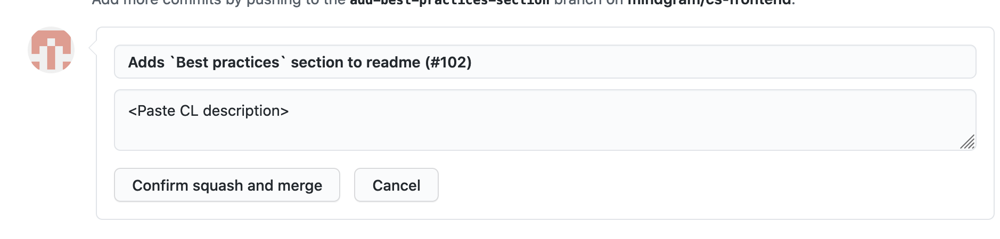

## Setup

- Install nvm (https://github.com/nvm-sh/nvm#installation-and-update)
- Install node: `nvm install`
- Install [`yarn`](https://yarnpkg.com/lang/en/): `brew install yarn --without-node`
- Install dependencies: `yarn`

## Heatmap2

```
yarn start
```

## Tests

```
yarn test
```

## Storybook

We use [Storybook](https://storybook.js.org) to build out our library of reusable React components.

Our production storybook is being served at https://mindgram.github.io/cs-frontend

**Run storybook**

```
yarn run story
```

**Build storybook**

In order to update our production storybook, run the following command and commit the `docs/` folder:

```
yarn run build-story
```

## Best practices

### Pull Requests

- [Good PR/commit subject and body](https://github.com/spring-projects/spring-framework/blob/30bce7/CONTRIBUTING.md#format-commit-messages)

  ```
  Short (50 chars or less) summary of changes

  More detailed explanatory text, if necessary. Wrap it to about 72
  characters or so. In some contexts, the first line is treated as the
  subject of an email and the rest of the text as the body. The blank
  line separating the summary from the body is critical (unless you omit
  the body entirely); tools like rebase can get confused if you run the
  two together.

  Further paragraphs come after blank lines.

  - Bullet points are okay, too

  - Typically a hyphen or asterisk is used for the bullet, preceded by a
  single space, with blank lines in between, but conventions vary here

  Issue: SPR-1234, SPR-1235
  ```

  > 1. Use imperative statements in the subject line, e.g. "Fix broken Javadoc link"
  > 2. Begin the subject line sentence with a capitalized verb, e.g. "Add, Prune, Fix, Introduce, Avoid, etc"
  > 3. Do not end the subject line with a period
  > 4. Keep the subject line to 50 characters or less if possible
  > 5. Wrap lines in the body at 72 characters or less
  > 6. Mention associated jira issue(s) at the end of the commit comment, prefixed with "Issue: " as above
  > 7. In the body of the commit message, explain how things worked before this commit, what has changed, and how things work now

  - [Why do we care about good commit messages?](https://google.github.io/eng-practices/review/developer/cl-descriptions.html)

    > A CL description is a public record of what change is being made and why it was made. It will become a permanent part of our version control history, and will possibly be read by hundreds of people other than your reviewers over the years.

    > Future developers will search for your CL based on its description. Someone in the future might be looking for your change because of a faint memory of its relevance but without the specifics handy. If all the important information is in the code and not the description, it’s going to be a lot harder for them to locate your CL.

* Adding to the point above, always "squash" multiple commits into atomic changes before merging.
  A good rule of thumb is copying over the PR title and body into
  the "Squash and merge" boxes.
  - 
* Keep PRs small and scoped to a particular bug, feature.
  - Easier to review
  - Easier to revert
